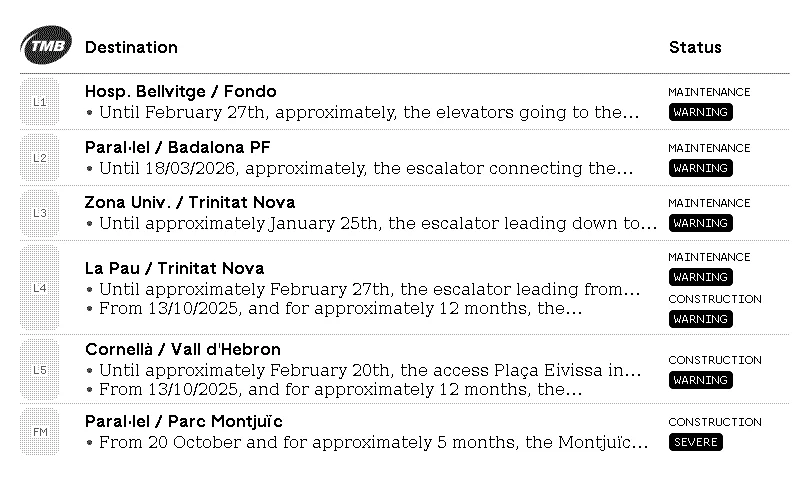
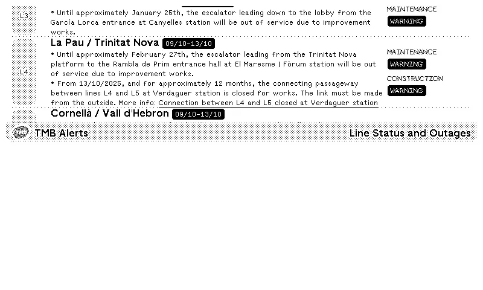
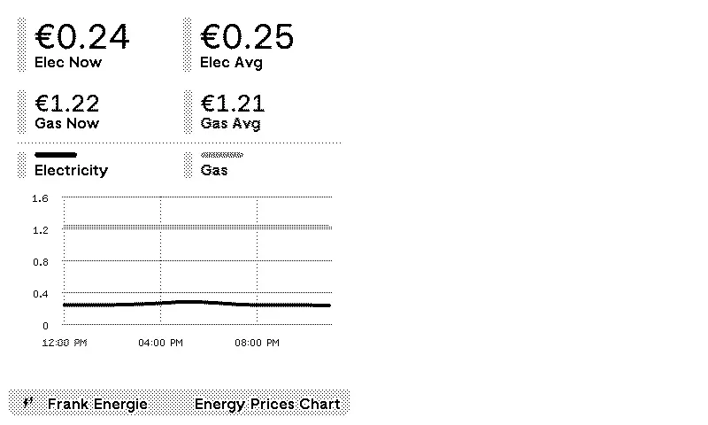
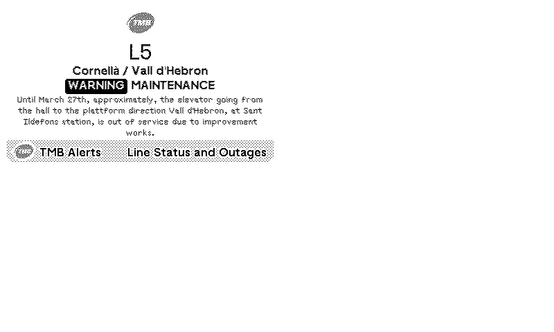

# TRMNL TMB Plugin

A TRMNL plugin to display TMB ( Barcelona Metro ) service status and outages.

## Icon

The plugin icon is stored in the TRMNL bundle and referenced from settings.yml.

	

## Previews

| Full View | Half Horizontal View |
|------------|----------------------|
|  |  |

| Half Vertical View | Quadrant View |
|-------------------|----------------|
|  |  |

## Templates

- **full.liquid**: Default view clear view of Metro Line, destination name, description and status of outage.
- **half_horizontal**.liquid and **half_vertical.liquid**: Compact variants of the full view.
- **quadrant.liquid**: Minimal view. Displays the most most grave status.
