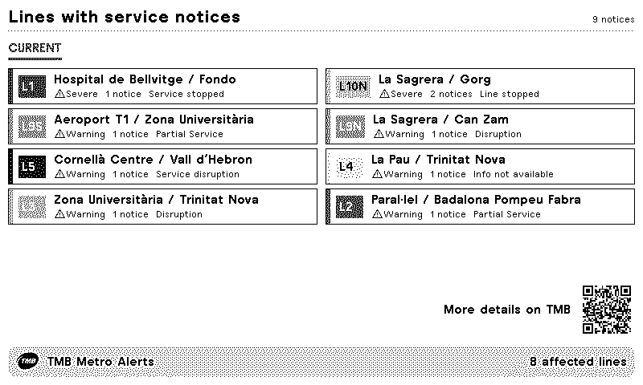
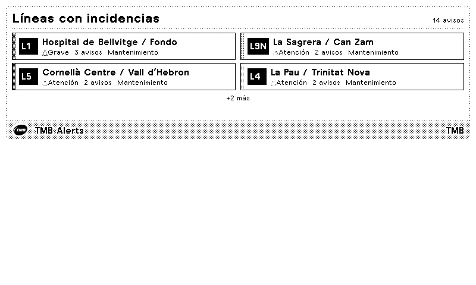
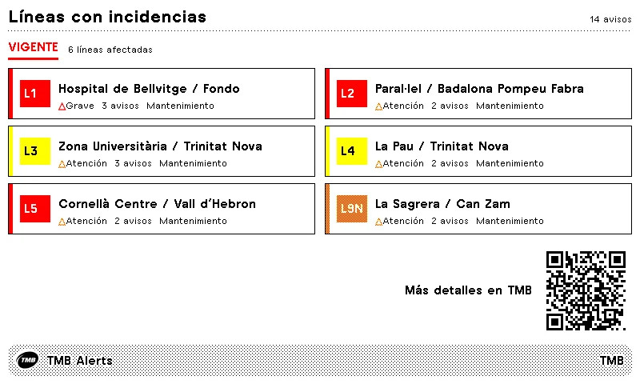
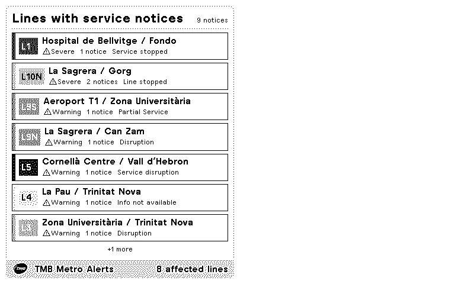
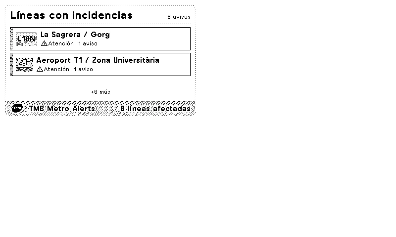
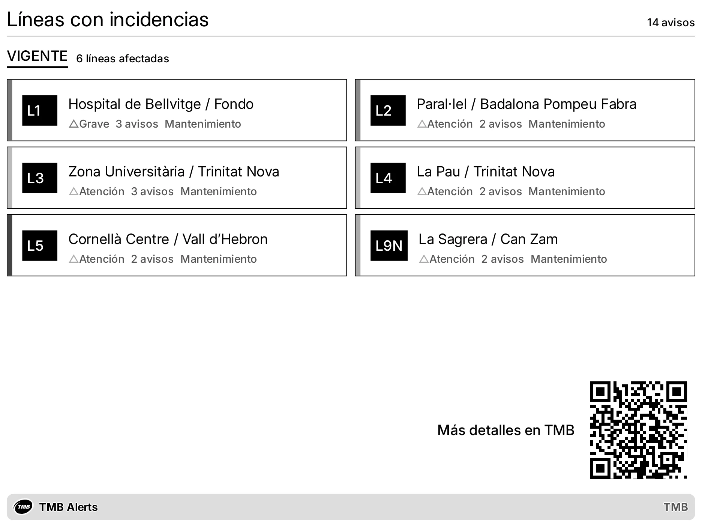
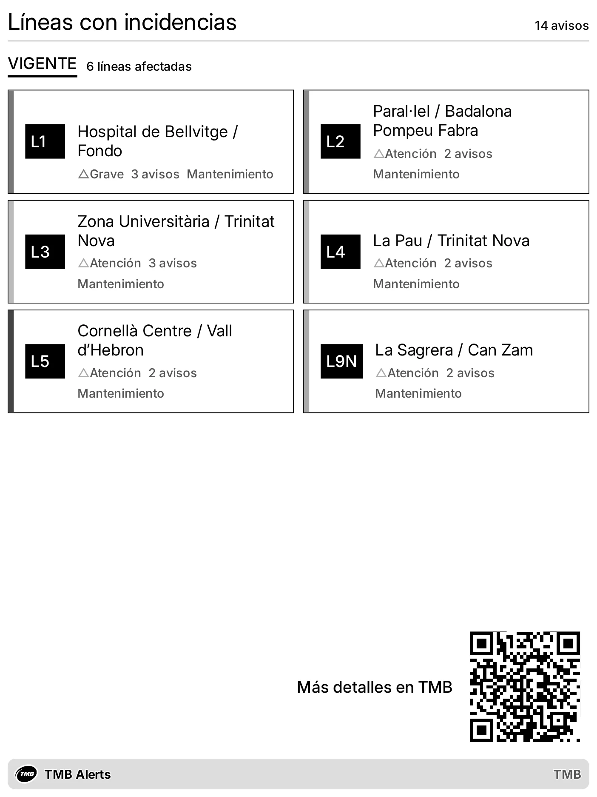

# TRMNL TMB Plugin

A TRMNL plugin that displays current Barcelona Metro service notices in Catalan, Spanish or English.

## Icon

The plugin icon is stored in the TRMNL bundle and referenced from settings.yml.

	

## Previews

Previews use synthetic service notices and do not represent live TMB status.

| Full View | Half Horizontal View |
|------------|----------------------|
|  |  |

| BWRY Full View |
|----------------|
|  |

| Half Vertical View | Quadrant View |
|-------------------|----------------|
|  |  |

| TRMNL X Landscape | TRMNL X Portrait |
|-------------------|------------------|
|  |  |

## Templates

- **shared.liquid**: Feed normalization, translations, priority ordering, shared styles and the reusable line-card component.
- **full.liquid**: All affected lines in a two-column grid, plus a QR link to TMB's live detail page.
- **half_horizontal.liquid**: Up to four affected lines in a 2×2 grid.
- **half_vertical.liquid**: Up to six affected lines in a single column.
- **quadrant.liquid**: The two highest-priority affected lines plus the remaining-line count.

The layouts use Framework 3.3 responsive clamps, overflow handling and palette-aware color utilities. The same markup renders in grayscale, on the black/white/red/yellow BWRY palette, and at TRMNL X landscape or portrait sizes.
