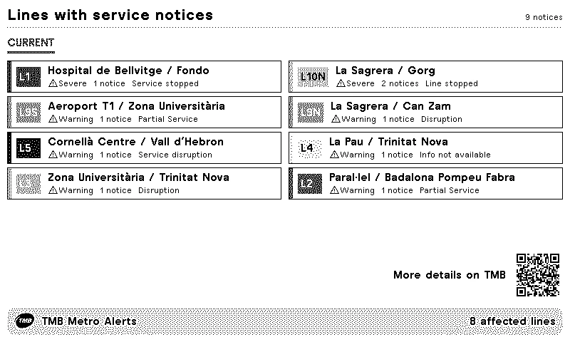
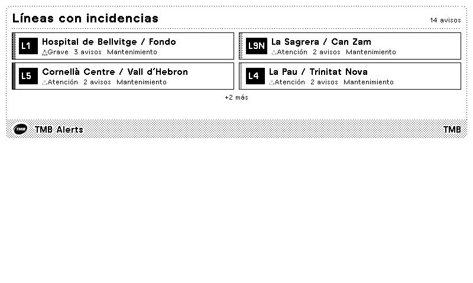
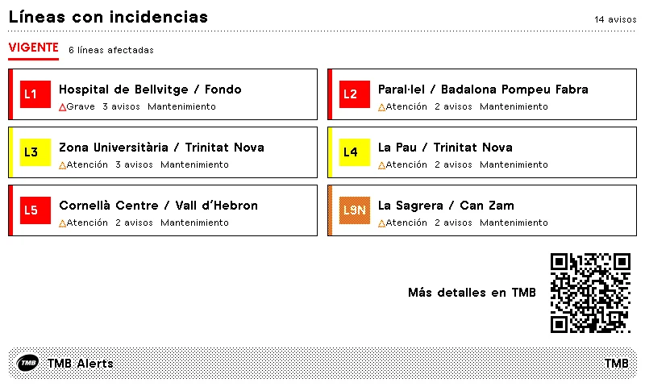
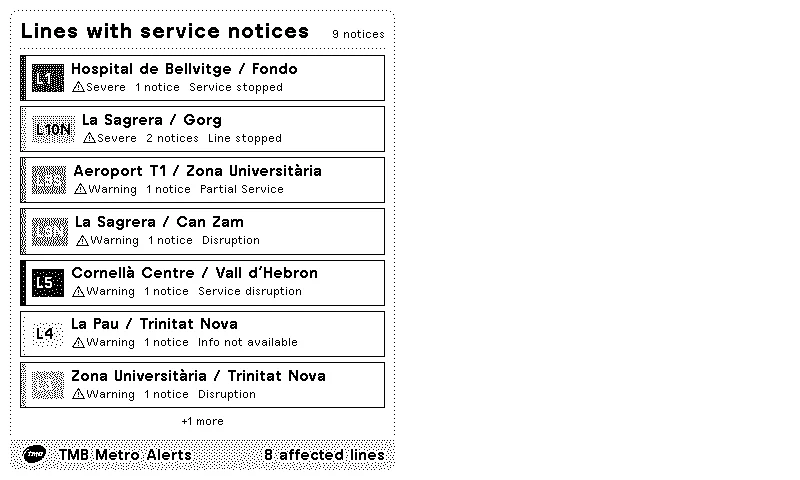
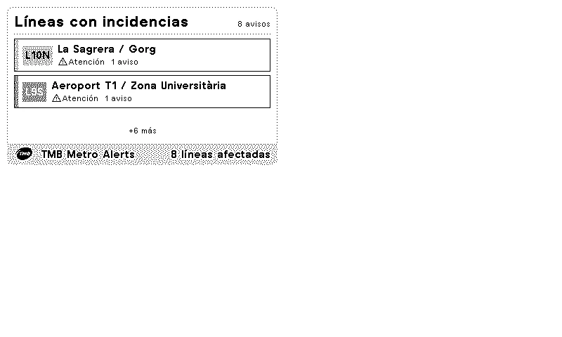
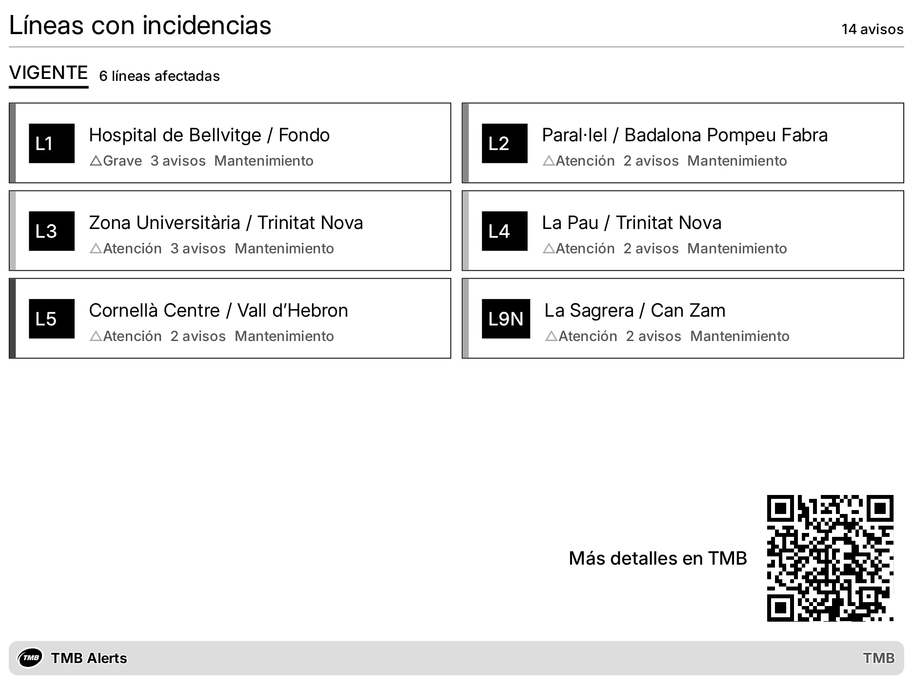
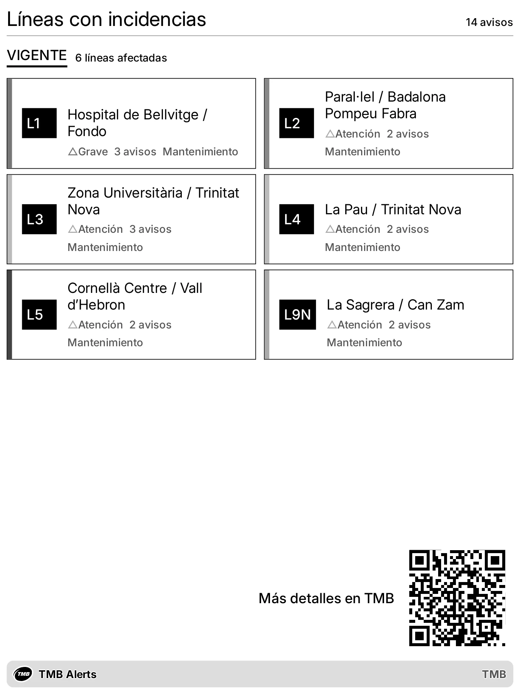

# TRMNL TMB Plugin

A TRMNL plugin that displays current Barcelona Metro service notices in Catalan, Spanish or English.

## Icon

The plugin icon is stored in the TRMNL bundle and referenced from settings.yml.

	

## Previews

Previews use synthetic service notices and do not represent live TMB status.

| Full View | Half Horizontal View |
|------------|----------------------|
|  |  |

| BWRY Full View |
|----------------|
|  |

| Half Vertical View | Quadrant View |
|-------------------|----------------|
|  |  |

| TRMNL X Landscape | TRMNL X Portrait |
|-------------------|------------------|
|  |  |

## Templates

- **shared.liquid**: Feed normalization, translations, priority ordering, shared styles and the reusable line-card component.
- **full.liquid**: All affected lines in a two-column grid, plus a QR link to TMB's live detail page.
- **half_horizontal.liquid**: Up to four affected lines in a 2×2 grid.
- **half_vertical.liquid**: Up to seven affected lines in a single column.
- **quadrant.liquid**: The two highest-priority affected lines plus the remaining-line count.

The layouts use Framework 3.3.1 responsive clamps, overflow handling and palette-aware color utilities. The same markup renders in grayscale, on the black/white/red/yellow BWRY palette, and at TRMNL X landscape or portrait sizes.

## Setup

Register at the [TMB developer portal](https://developer.tmb.cat/docs/getting-started), enter your App ID and App Key, choose a language, save, and Force Refresh. Keep credentials in your private settings; use synthetic notices for public previews.

## Public recipe review

The original plugin design, parsing logic and markup are also offered under [CC BY 4.0](../LICENSE), matching [TRMNL’s public plugin license](https://trmnl.com/plugin-license). Third-party content keeps its own terms. For support, [open a GitHub issue](https://github.com/taichikuji/trmnl-tmb-plugin/issues).

All four layouts render a native title bar. Display icons are monochrome SVGs, so raster dithering is unnecessary. Data requests run in native polling; no Serverless fetch is needed.

Before submitting, save each setting in TRMNL, check all four views on OG and X (landscape and portrait), use a public demo preview, and review CHEF feedback. Repository checks and a successful upload do not replace these dashboard checks or human approval.
